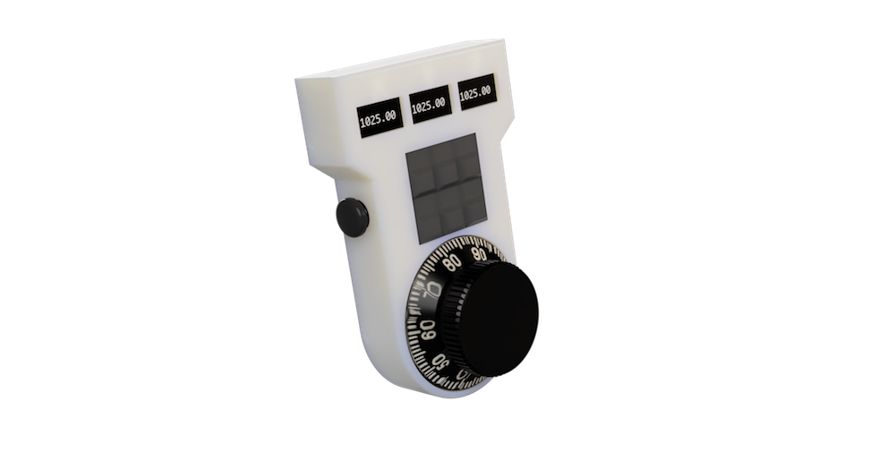

  

<h3 align="center">Reprap Remote</h3>

---

 A remote controller for our beloved reprap firmware.
      

## 📝 Table of Contents

- [About](#about)
- [Usage](#usage)

## 🧐 About 

### Jogging
- Multipilcator Potentiometer
- Joystick
- Z Potentiometer
- What do to with other Axis then those 3 ? Even relevant ? If you read this and think "eeehm yes", please open an issue.
### Pause
- Button
### Emergency Stop
- Button or maybe emergency button, might be bad idea and revoked in design later on
### Macro Trigger
- Macro selector or dedicated buttons
### OLED Screen
Information:
- X
- Y
- Z
- Percentage

## 🎈 Usage 

Add notes about how to use the system.
